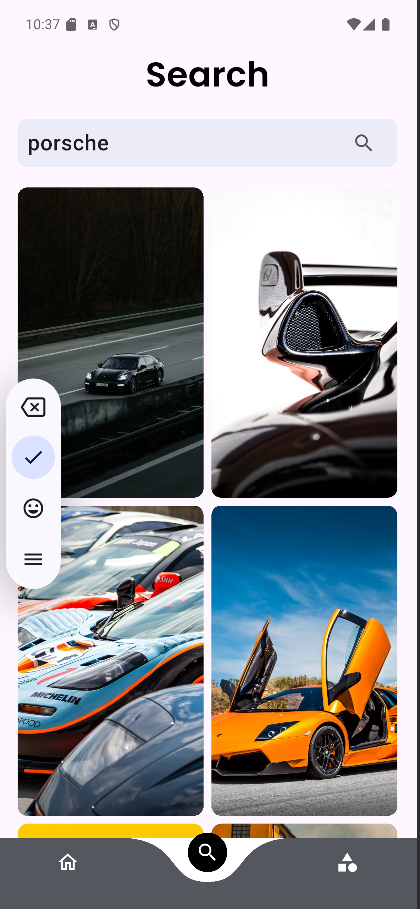

# Wallify - Flutter Wallpaper App

Wallify is a beautiful and feature-rich wallpaper app built using Flutter. It fetches high-quality wallpapers from the **Pexels API** and allows users to explore, search, and download wallpapers to their phone's gallery. The app also includes **Firebase Authentication**, enabling users to securely log in and save their favorite wallpapers.

## Features

- 🔥 **High-Quality Wallpapers** – Browse a vast collection of stunning wallpapers from Pexels API.
- 🔍 **Search Functionality** – Search wallpapers by keyword.
- 🏷️ **Category & Tag Filtering** – Easily find wallpapers based on categories or tags.
- 💾 **Save to Gallery** – Download wallpapers directly to your phone's gallery.
- 🔐 **Firebase Authentication** – Secure login and authentication using Firebase.

## Tech Stack

- **Flutter** – Cross-platform UI development.
- **Dart** – Programming language for Flutter.
- **Firebase Authentication** – Secure user login & authentication.
- **Pexels API** – Fetch high-quality images.
- **Dio** – API calls & network handling.
- **Provider** – State management.
- **Path Provider & Image Gallery Saver** – Save images to local storage.

## Installation & Setup

1. Clone the repository:
   ```sh
   git clone https://github.com/krishmaniyar/Wallpaper-App.git
   cd Wallpaper-App
   ```
2. Install dependencies:
   ```sh
   flutter pub get
   ```
3.Set up **Firebase Authentication**:
    - Follow [Firebase setup guide](https://firebase.google.com/docs/flutter/setup)
    - Add `google-services.json` (Android) and `GoogleService-Info.plist` (iOS) to the project.
4.Run the app:
   ```sh
   flutter run
   ```

## Screenshots

### Home Screen


### Category Screen


### Full Screen


### Login Screen


### Search Screen


## Contributing

Contributions are welcome! Feel free to fork the repo and submit a pull request.

## License

This project is licensed under the **MIT License**.

---

🚀 **Developed by Krish Maniyar**

